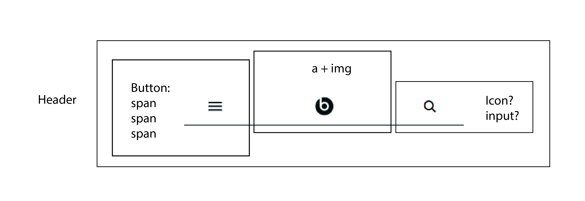
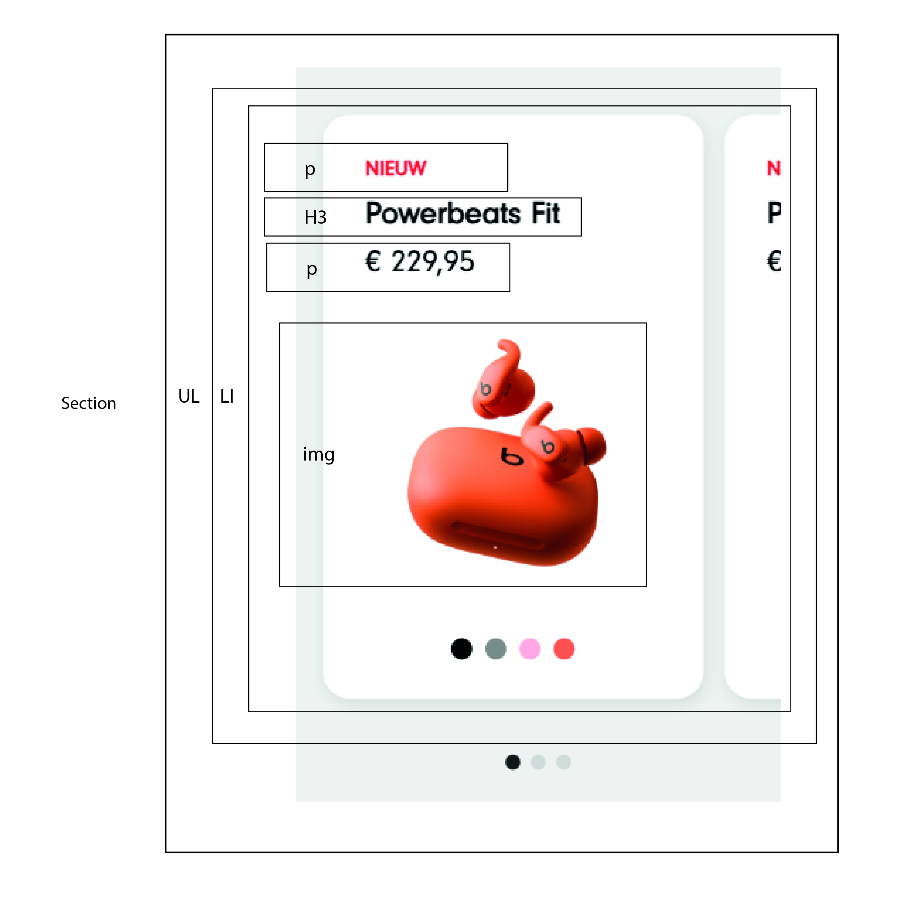
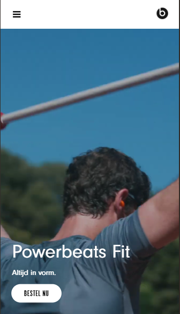
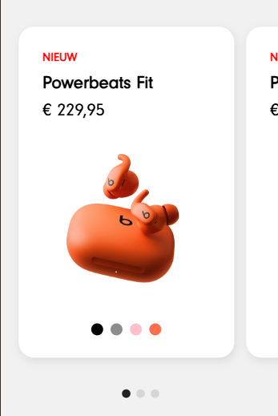
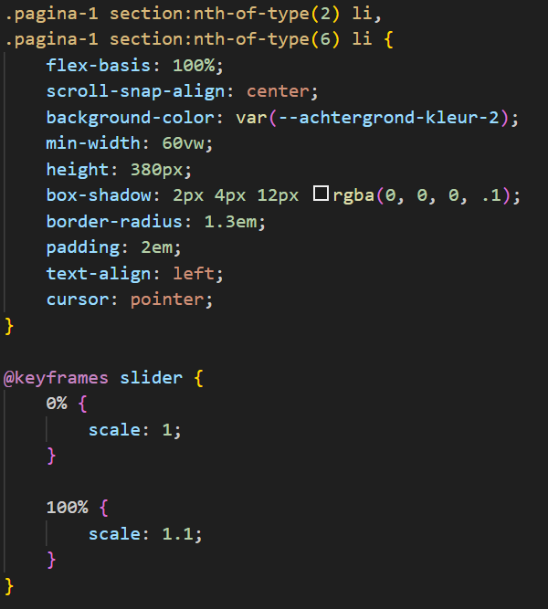
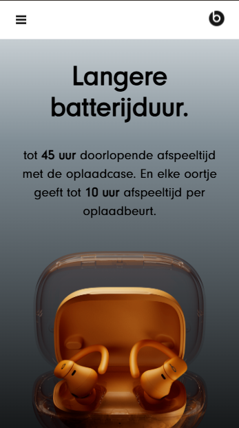
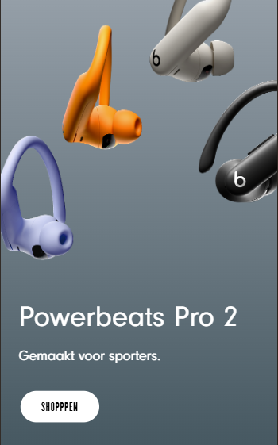
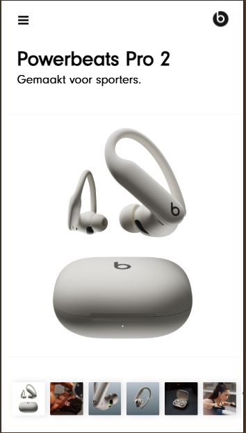

# Procesverslag
Markdown is een simpele manier om HTML te schrijven.  
Markdown cheat cheet: [Hulp bij het schrijven van Markdown](https://github.com/adam-p/markdown-here/wiki/Markdown-Cheatsheet).

Nb. De standaardstructuur en de spartaanse opmaak van de README.md zijn helemaal prima. Het gaat om de inhoud van je procesverslag. Besteedt de tijd voor pracht en praal aan je website.

Nb. Door *open* toe te voegen aan een *details* element kun je deze standaard open zetten. Fijn om dat steeds voor de relevante stuk(ken) te doen.

## Jij

  
uitwerken voor kick-off werkgroep

  ### Auteur:
  Sana Iqbal

  #### Je startniveau:
  blauw

  #### Je focus:
  Surface plane
 

## Je website

  
uitwerken voor kick-off werkgroep

  ### Je opdracht:
https://www.beatsbydre.com/nl

  #### Screenshot(s) van de eerste pagina (small screen): 
  home-pagina
  

  #### Screenshot(s) van de tweede pagina (small screen):
  product-pagina
  
 

## Toegankelijkheidstest 1/2 (week 1)

  
uitwerken na test in 2e werkgroep

  ### Bevindingen
  Lijst met je bevindingen die in de test naar voren kwamen: 
  
  - viewport is aanpasbaar, kan in elke richting worden gedraaid
  - Validatie klopt niet helemaal, paar errors aanwezig
  - Navigatie met toetsenbord gaat goed, focus volgorde komt overeen met de visuele lay-out.  (Bij de home-pagina gaat na de focus van de nav naar de "play-knop" van de video in plaats van naar het "bestel op" knop. Kan anders?...)
  - Horizontaal scrollen alleen aanwezig bij het switchen van vorige/volgende pagina's
  - Heading elementen staan in de goede volgorde. (H1 op de home-pagina is niet aanwezig op de site, maar wel in de code. Op de ene laptop staat er wel een H1, maar bij een andere staat er een H2)
  - Gebruik van list elementen aanwezig
  - Alt teksten voor images aanwezig
  - sommige media staat op auto-play, kan wel gepauseerd worden
  - Geen "skip-link" aanwezig
  - Bij slider is niet duidelijk wat precies de link is. Het vakje zelf of de tekst?..
  - Geen dark mode aanwezig

## Breakdownschets (week 1)

  
uitwerken na afloop 3e werkgroep

  ### de hele pagina: 
  

  ### dynamisch deel (bijv menu): 
  

  ### wellicht nog een dynamisch deel (bijv filter): 
  

## Voortgang 1 (week 2)

  
uitwerken voor 1e voortgang

  ### Stand van zaken
  hier dit ging goed & dit was lastig (neem ook screenshots op van delen van je website en code)

   ### Agenda voor meeting
  samen met je groepje opstellen

  | student 1: Victoria      | student 2: Juliette      | student 3: Cheyenne  | student 4: Ana        |
  | ---            | ---                | ---          | ---              |
  | Geen P nodig bij bij een link, Img hoef je niet in een figure te wrappen |Aria-label voor screenreader             | H3 gebruiken voor kleiner kopjes, kan alleen als er een H2 boven staat   | Als je ergens iets kan invullen, is dat een input    |
  | Als je in de header veel linkjes hebt is het beter om een nav te gebruiken | Section moet een heading bevatten | Details elementen toepassen, footer hoeft geen heading, # gebruiken voor onnodige links | De list zelf is de ul, waarin de li's zitten |
  | ...            | ...                | ...          | ...              |

  ### Verslag van meeting
  hier na afloop snel de uitkomsten van de meeting vastleggen

  - Format document gebruiken om bestand netter te maken
  - Alle sections hebben een heading nodig
  - ...

## Voortgang 2 (week 3)

  
uitwerken voor 2e voortgang

  ### Stand van zaken
  hier dit ging goed & dit was lastig (neem ook screenshots op van delen van je website en code)
  
  - Het lukte niet om de tekst op de video te krijgen en de h1 en p goed te positioneren.
  

  ### Agenda voor meeting
  samen met je groepje opstellen

  | student 1      | student 2          | student 3    | student 4        |
  | ---            | ---                | ---          | ---              |
  | dit bespreken  | en dit             | en ik dit    | en dan ik dat    |
  | en dat ook nog | dit als er tijd is | nog een punt | dit wil ik zeker |
  | ...            | ...                | ...          | ...              |

  ### Verslag van meeting
  hier na afloop snel de uitkomsten van de meeting vastleggen

  - Tekst op video zetten doormiddel van position relative en absolute
  - Div kan je wel gebruiken om elementen vorm te geven

- ...

## Toegankelijkheidstest 2/2 (week 4)

  
uitwerken na test in 9e werkgroep

  ### Bevindingen
  Lijst met je bevindingen die in de test naar voren kwamen (geef ook aan wat er verbeterd is):
  - Elementen zoals buttons en links zijn beschrijvend
  - Aria-labels voor links toegevoegd (verbeterd)
  - HTML gevalideerd
  - Focus state is zichtbaar voor interactieve elementen, alleen niet bij carousel. Het krijgt wel focus, maar geen lijn/styling eromheen. Focusvolgorde komt wel overeen met de layout. Navigatie met toetsenbord gaat goed
  - Gebruik van kopteksten aanwezig, één h1 per pagina ook aanwezig. Kopteksten staan in een logische volgorde. Geen kopniveaus overgeslagen.
  - Gebruik van ul aanwezig.
  - img elementen hebben een alt tekst. decoratieve elementen hebben null alt. 
  - Sommige media wordt niet automatisch afgespeeld (verbeterd), sommige wel. Sommige videos kunnen gepauzeerd worden (verbeterd), sommige niet.
  - Button element op goede manier gebruikt.
  - Geen dark mode
  - Contrast voor tekst is aanwezig

## Voortgang 3 (week 4)

  
uitwerken voor 3e voortgang

  ### Stand van zaken
  hier dit ging goed & dit was lastig (neem ook screenshots op van delen van je website en code)

  - De carousel was een beetje lastig te maken, code was niet helemaal duidelijk. Maar uiteindelijk wel gelukt. Ook is er op de officiele website een animatie op de carousel voor de scaling, maar dat is met javascript gedaan, dus was te lastig. Daarom heb ik het geprobeerd om het met css te doen.
  
  

  ### Agenda voor meeting
  samen met je groepje opstellen

  | student 1      | student 2          | student 3    | student 4        |
  | ---            | ---                | ---          | ---              |
  | dit bespreken  | en dit             | en ik dit    | en dan ik dat    |
  | en dat ook nog | dit als er tijd is | nog een punt | dit wil ik zeker |
  | ...            | ...                | ...          | ...              |

  ### Verslag van meeting
  hier na afloop snel de uitkomsten van de meeting vastleggen

  - Je hoeft niet voor elk element de focus state toe te voegen, dat gat automatisch. Wel kan je zelf anders stijlen
  - Animatie met css geprobeerd

  - ...

## Eindgesprek (week 5)

  
uitwerken voor eindgesprek

  ### Je uitkomst - karakteristiek screenshots:
  

  ### Dit ging goed/Heb ik geleerd: 
  - Ik begrijp nu meer over de positionering van elementen en het verschil tussen relative, absolute, fixed en sticky ook al twijfel ik nog steeds wel een beetje. En ook hoe je elementen boven elkaar plaats zoals tekst of buttons op een video of image. Ook  heb ik geleerd hoe je images op de juist formaat kan zetten, zodat het goed op de scherm past.

  - Ook heb ik geleerd dat je zonder classes semantisch kunt werken door gebruik te maken van selectors zoals :nth-of-type(). Daarnaast heb ik ook meer kennis opgedaan met de toegangelijkheid van de website.

  

  ### Dit was lastig/Is niet gelukt:
  - Het responsive maken van mijn website vond ik het lastigste. Ik koos eerst voor de opdracht "Responsive", maar dit bleek een beetje moeilijk te zijn voor mij, dus ben ik overgestapt naar surface plane. Ook het maken van een dark mode ging niet soepel. Per element moet je aangeven welke kleuren moeten veranderen en sommige afbeeldingen waren niet transparant, waardoor ze niet goed zichtbaar waren op een donkere achtergrond. Dit kostte te veel tijd, dus heb ik besloten dit niet te doen. Ook vond ik het lastig om meer surface plane elementen toe te voegen, omdat de officiële website heel simpel, clean en strak is. Grote animaties of veel kleuren passen daar niet bij. Ik heb daarom gekozen voor kleine effecten zoals hover states en transitions.
  

  

## Bronnenlijst

  
continu bijhouden terwijl je werkt

  Nb. Wees specifiek ('css-tricks' als bron is bijv. niet specifiek genoeg). 
  Nb. ChatGpT en andere AI horen er ook bij.
  Nb. Vermeld de bronnen ook in je code.

  1. ChatGPT: Menu openklappen, fieldset gebruiken om gerelateerde form inputs te groeperen.
  2. https://www.w3schools.com/tags/tag_fieldset.asp (Fieldset)
  3. ChatGPT: background clip gebruiken voor witte ruimte in de kleurcirkels
  4. Carousel hulpmiddel: https://developer.mozilla.org/en-US/docs/Web/CSS/Guides/Overflow/Carousels#single_page_carousel_final_result

